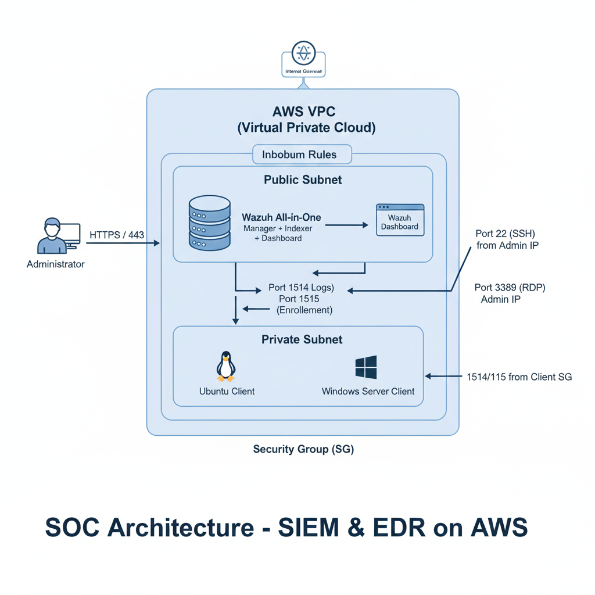

  | 
**UNIVERSITÉ HASSAN II DE CASABLANCA**    ENSET MOHAMMEDIA    *DEPARTEMENT DE MATHEMATIQUES INFORMATIQUE*
 |  |
| :--- | :---: | ---: |

# 📊 ATELIER PRATIQUE :
## Mise en Place d'un  SOC Moderne  Dans le Cloud AWS avec Wazuh ( AWS EC2)

 
 
 
 
 

     

## 🎓 Informations Générales :
* **Filière :** Ingénierie Informatique Big Data Cloud Computing (IIBDCC)
* **Module :** Sécurité des SI & Cyber Sécurité
* **Réalisé par :** TSEH Kokou Benoît
* **Encadré par :** Prof. Azeddine KHIAT
* **Année Universitaire :** 2025-2026

---

## Introduction : 

Dans un contexte de cybermenaces en constante évolution, la capacité d'une organisation à 
détecter et à répondre rapidement aux incidents est devenue un enjeu stratégique majeur. Les 
entreprises ne se contentent plus de simples pare-feu, mais déploient désormais des centres 
d'opérations de sécurité (SOC) capables de surveiller en temps réel chaque mouvement sur leur 
réseau. Cet atelier pratique s'inscrit dans cette démarche en mettant en œuvre la solution open
source Wazuh, une plateforme hybride performante qui fusionne les capacités d'un SIEM pour 
la gestion centralisée des journaux et d'un EDR pour la détection avancée sur les points de 
terminaison.  
Le déploiement est réalisé sur l'infrastructure Cloud AWS Learner Lab, offrant un 
environnement réaliste pour simuler une architecture d'entreprise moderne. Le projet s'articule 
autour d'un serveur central Ubuntu assurant la corrélation des données, et de deux clients 
distincts : une machine Linux et un serveur Windows Server 2025. Cette diversité permet 
d'explorer les mécanismes de surveillance spécifiques à chaque système d'exploitation, tout en 
garantissant une communication sécurisée à travers un VPC configuré rigoureusement pour 
n'autoriser que les flux de télémétrie et d'administration nécessaires. 
L'objectif de ce TP est de confronter la théorie à la pratique à travers trois piliers fondamentaux 
de la cybersécurité : le durcissement des systèmes (Hardening), la gestion des identités et des 
accès (IAM) et la traque active des menaces (Threat Hunting). En simulant des scénarios réels, 
tels que des attaques par force brute ou des modifications frauduleuses de fichiers système, nous 
analyserons la capacité de Wazuh à alerter les administrateurs et à fournir des données 
contextuelles précises via son tableau de bord. Cette expérience vise ainsi à acquérir une vision 
opérationnelle complète de la chaîne de détection, depuis l'événement brut sur le client jusqu'à 
l'analyse critique dans le SIEM.

## Architecture Gloabale du projet : 

L'architecture repose sur un modèle Client-Serveur déployé dans un environnement Cloud AWS, conçu pour simuler un centre d'opérations de sécurité (SOC) moderne traitant des flux de télémétrie provenant de systèmes d'exploitation hétérogènes.

1. Schéma Conceptuel de l'Infrastructure

L'ensemble des composants est isolé au sein d'un VPC (Virtual Private Cloud) unique sur AWS, garantissant une communication fluide et sécurisée.

- Plan de Contrôle (Serveur Central) : Une instance EC2 robuste (t3.large) centralisant l'intelligence du système.

- Plan de Données (Agents) : Un parc mixte composé d'instances Linux et Windows agissant comme sources de données.

- Flux de Communication : Utilisation de protocoles sécurisés pour le transport des logs et l'administration.

2. Détail des Composants (Instances EC2)

| Composant | Rôle Technique | Système d'Exploitation | Spécifications AWS |
| :--- | :--- | :--- | :--- |
| **Wazuh All-in-One** | **Serveur Central** : Manager (corrélation), Indexer (stockage), Dashboard (visualisation). | Ubuntu 22.04 LTS | Instance `t3.large`, 30GB SSD |
| **Agent Linux** | **Client supervisé** : Envoi des logs système, SSH et surveillance d'intégrité (FIM). | Ubuntu 22.04 LTS | Instance `t2.micro` |
| **Agent Windows** | **Client supervisé + EDR** : Analyse des logs de sécurité Windows et télémétrie avancée via **Sysmon**. | Windows Server 2025 | Instance `t3.medium` |

3. Matrice de Flux et Sécurité (Security Groups)

| Composant | Rôle Technique | Système d'Exploitation | Spécifications AWS |
| :--- | :--- | :--- | :--- |
| **Wazuh All-in-One** | **Serveur Central** : Manager (corrélation), Indexer (stockage), Dashboard (visualisation). | Ubuntu 22.04 LTS | Instance `t3.large`, 30GB SSD |
| **Agent Linux** | **Client supervisé** : Envoi des logs système, SSH et surveillance d'intégrité (FIM). | Ubuntu 22.04 LTS | Instance `t2.micro` |
| **Agent Windows** | **Client supervisé + EDR** : Analyse des logs de sécurité Windows et télémétrie avancée via **Sysmon**. | Windows Server 2025 | Instance `t3.medium` |

## Création des instances 

 On ce connecte au console de AWS et on crée les instances  avec les caractéristiques décrites précédemment :

   

 